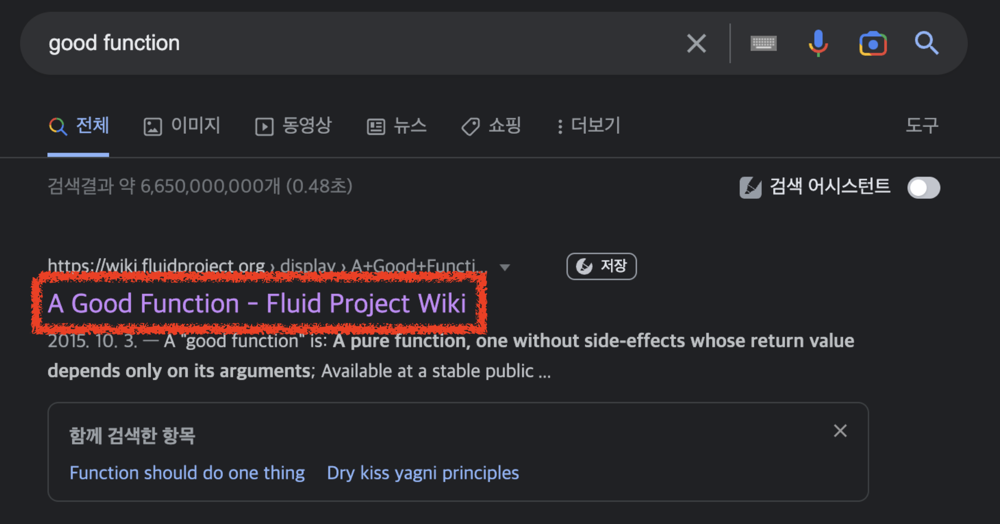
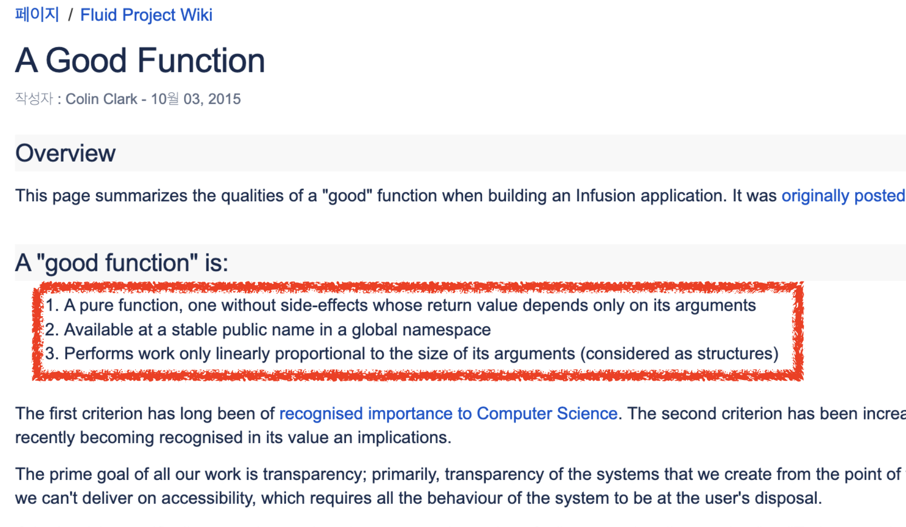
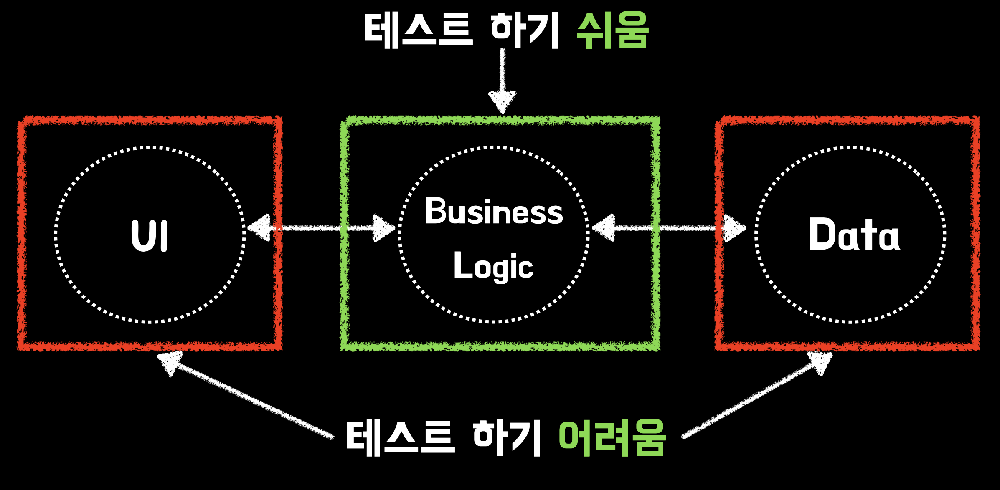
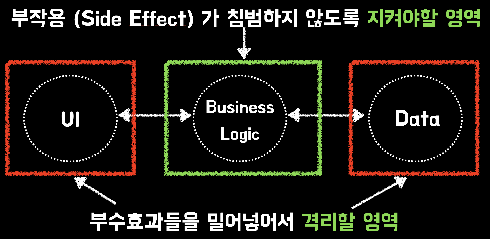

# 1. 좋은 함수 만들기 - 부작용과 거리두기

요즘의 개발에서 프레임워크나 라이브러리 사용이 없는 개발은 생각하기 어렵다.  
특히 DDD 등의 개념까지 **기본지식처럼 취급**되어 점점 추상화된 개발에 익숙해지고 있다.  
복잡한 애플리케이션 구현을 하다보면 이러한 것들에 대해 당연히 필요하다.   
  
다만, 이게 심해지다보면 실제 구현을 해야할 변수, 함수, 클래스 등을 잘 작성하는 것보다 **프레임워크나 라이브러리의 기능을 얼마나 많이 알고 있느냐**를 개발자의 성장으로 오해할 수도 있다.  
  
프레임워크와 라이브버리와 같은 도구에 대해서 숙련도가 높다면 당연히 좋겠지만, 그 이전에 **좋은 변수, 함수, 클래스에 대해 먼저 고민**하는 것도 필요하다.  
  
그래서 이번 시리즈에서는 좋은 함수에 대해서 이야기하려고 한다.

> JS/TS 환경에서 불변객체 다루는 방법이 순수 함수형 언어들에 비해 좋은 편은 아니라서, 이 글에서 함수형 프로그래밍에 대해 직접적인 언급을 하진 않을 예정이다.
> 어디까지나 좋은 "함수"에 대해서만 이야기한다.

## 좋은 함수

구글에서 좋은 함수 (Good Function)에 대해 검색해보면 다음과 같이 **순수 함수**에 대한 이야기가 자주 언급된다.



- https://wiki.fluidproject.org/display/fluid/A+Good+Function



순수함수란 무엇인지 요즘 유행하는 (?) [ChatGPT](https://chat.openai.com/chat) 에게 한번 물어보자.


- 동일한 입력이 주어지면 항상 동일한 출력을 반환하면서, 부작용 (Side Effect) 이 없는 함수
- 함수의 범위를 벗어난 상태 (전역변수 등)와 호출한 함수 등에 의존하지 않는 함수

정리하면, **동일한 입력일 경우 항상 동일한 출력을 반환하며, 부작용이 없는 함수**를 작성한다면 우린 좋은 함수를 작성한다고 할 수 있다.  
  
하지만 웹/앱 서비스등을 개발하다보면 이러한 부작용 (Side Effect) 에 영향을 줄 수밖에 없는데, 어떻게 좋은 함수를 만들 수 있을까?  
  
간단한 예제로 한번 시작해본다.

## 예제 

다음과 같이 **각 기업들의 판매 정보를 가져와 판매금액을 정산 해주는 기능**을 만든다고 가정해보자.   

```ts
export async function sendCompanyFees(companySellings: CompanySelling[]) {
  for (const companySelling of companySellings) {
    const fee = companySelling.sellingAmount * companySelling.commission;

    if (fee >= 100) {
      await axiosSendFee(companySelling.bankCode, fee);
    }
  }

  Modal.open(`${companySellings.length} 개 기업들에게 송금되었습니다.`);
}
```

> `for` 를 `Promise.all` 로 리팩토링 해야하는 것은 여기서 중요 개선점은 아니다.


이 함수의 요구 사항은 다음과 같다.

* 기업 판매 정보 (`CompanySelling`) 들을 받아서
* 각 기업별 정산 금액 (`판매금액 * 정산율`) 을 계산 해서  
* 100원이 넘는 경우에만
* API로 전달한다.

이 함수는 여러 기능을 한 곳에서 하고 있다.  
여러 책에서 이야기하듯, **함수는 하나의 기능만** 할 수 있도록 리팩토링을 해보자.

## 리팩토링 1 (Bad)

먼저 언급된 기능들 별로 하나씩 함수로 추출 (`Extract Function`) 한다. 

```ts
// 전체 기능을 관리한다
export async function sendCompanyFees(companySellings: CompanySelling[]) {
  await sendFees(companySellings);
  Modal.open(`${companySellings.length} 개 기업들에게 송금되었습니다.`);
}

// companySellings 만큼 sendFee를 호출한다
export async function sendFees(companySellings: CompanySelling[]) {
  for (const companySelling of companySellings) {
    await sendFee(companySelling);
  }
}

// 100원이상인 경우 axiosSendFee를 호출한다
export async function sendFee(companySelling: CompanySelling) {
  const fee = getFee(companySelling);

  if (fee >= 100) {
    // 100원 이상이면 계산된 금액 송금하기
    await axiosSendFee(companySelling.bankCode, fee);
  }
}

function getFee(companySelling: CompanySelling) {
  return companySelling.sellingAmount * companySelling.commission;
}
```

기존에 1개였던 함수가 총 4개의 함수가 만들어졌다.  
각 함수는 아래와 같은 기능들을 한다.

- `sendCompanyFees`
  - `sendFees` 를 호출한다
  - `Modal` 로 결과를 출력한다
- `sendFees`
  - `companySellings` 전체를 순회하며 `sendFee` 를 호출한다
- `sendFee`
  - `getFee` 의 결과를 받아 `axiosSendFee` 에게 전달한다
- `getFee`
  - 정산금액을 계산한다

함수 하나가 1개의 기능을 담당하도록 잘 추출된 것처럼 보인다.  
이러면 좋은 함수를 만들어낸 것일까?  
  
위에서 언급했듯이 좋은 함수는 **테스트하기가 좋다**라고 했으니, 실제로 테스트하기도 좋아졌는지 한번 만들어보자.  
  
그리고 이 4개의 함수들 중 **순수 함수는 과연 몇개나 되는지** 한번 생각해보자.  
  
### 테스트 코드

먼저 가장 핵심 기능인 `sendFee` 의 테스트를 만들어본다.  
테스트를 작성하다보면 당연하게 **Mocking**이 필요함을 알게 된다.  

```ts
jest.mock('./api/axiosSendFee'); // API를 Mocking 한다

describe('sendFee', () => {
  it('100원이상이면 api를 호출한다', async () => {
    // when
    await sendFee({
      sellingAmount: 2000,
      commission: 0.1,
      bankCode: '032',
    });

    // then
    expect(axiosSendFee).toBeCalledTimes(1);
  });
});
```

그리고 테스트를 작성해보면 `sendFee` 의 테스트 코드 작성이 굉장히 어렵다는 것을 느낄 수 있다.
이렇게 작성된 테스트 코드는 크게 3가지 문제점이 있다.

#### (1) 상태 검증 불가능

이렇게 작성된 테스트 코드는 **다음과 같이 잘못 작성된 코드에서도 정상적으로 통과**되버린다.

```ts
export async function sendFee(companySelling: CompanySelling) {
  const fee = getFee(companySelling);

  if (fee >= 100) {
    await axiosSendFee(companySelling.bankCode, fee);
  }
}

function getFee(companySelling: CompanySelling) {
  // (*) 연산이 아닌 (+) 연산으로 잘못 작성된 코드
  return companySelling.sellingAmount + companySelling.commission;
}
```

- 외부 API를 호출하는 `axiosSendFee` 를 Mocking 하지 없으면 `sendFee` 의 테스트가 실패한다
- `sendFee` 가 잘 수행되었는지를 확인 하는 것은 Mocking을 한 `axiosSendFee` 가 의도한대로 **호출되었는지로만 검증**해야한다.
  - 의도한 금액대로 나왔는지는 `getFee` 함수를 검증해야하지만, 이 함수는 `sendFee` 에서만 사용될 **private function**이다.
  - 외부에서 호출하는 것을 막기 위해 `private function` 으로 선언했는데 테스트를 위해 scope를 `public` 으로 변경하면 코드 디자인이 무너질 수 있다.

위에서 작성된 코드는 axiosSendFee가 1번 호출되었냐만 검증하고 있는 **행위 검증**을 하는 테스트 코드이다.  
의도한대로 정산금이 만들어졌는지, 조건문에 맞는지 등 **상태 검증**을 하고 싶어도, 현재의 함수에서는 불가능하다.  

> 이 부분에 대한 자세한 소개는 마틴 파울러의 [mocks-arent-stubs](https://sungjk.github.io/2022/02/03/mocks-arent-stubs.html) 을 참고해보자.

#### (2) Mocking 대상 교체

이 테스트가 성립되기 위해서는 `axiosSendFee` 를 항상 Mokcing 해야만 한다.   
문제는 `sendFee` 가 호출해야하는 외부의 함수가 `axiosSendFee` 가 아니라 **react-query와 같이 아예 구현 방법이 다른** 라이브러리로 변경될 경우이다.  
이렇게 되면 기존에 작성된 `axiosSendFee` 를 Mocking 해서 검증하던 모든 테스트 코드들이 변경대상이 된다.  
라이브러리 하나 교체했다고 모든 테스트 코드들이 전부 수정대상이 되버린 것이다.  

#### (3) 테스트 도구 교체

(2)와 비슷한 이유로, 이번에는 **테스트 라이브러리가 교체**되는 이슈도 있다.  
예를 들어 요즘처럼 [Jest의 성능 이슈](https://github.com/facebook/jest/issues/11956)가 계속 발생할때면 Mocha 등 다른 테스트 프레임워크로 언제든 교체할 수 있다.  
이때 역시 마찬가지로 기존의 모든 Mocking을 하던 테스트 코드들은 수정 대상이 된다.  
  

문제는 이 `sendFee` 만 그런것이 아니다.  
다른 함수인 `sendFee`를 호출하는 `sendFees` 함수도 여전히 이 문제를 벗어날 수 없다.

```ts
jest.mock('./api/axiosSendFee'); // API를 Mocking 한다
describe('sendFees', () => {
  it('100원이상인 건수만큼 api를 호출한다', async () => {
    //given
    const sellings = [
      {
        sellingAmount: 1000,
        commission: 0.1,
        bankCode: '032',
      },
      {
        sellingAmount: 100,
        commission: 0.1,
        bankCode: '032',
      },
    ];

    // when
    await sendFees(sellings);

    // then
    expect(axiosSendFee).toBeCalledTimes(1);
  });
});
```

함수가 하나의 기능만 하도록 변경하고, 4개의 함수로 추출했지만, 그 어느 함수도 편하게 테스트를 작성할 수 있는 함수가 없다.  
어떻게 리팩토링을 했어야하는 것일까?

## 리팩토링 2 (Good)

현재의 테스트를 어렵게 만드는 것은 무엇인가?  
바로 외부에 영향을 끼치는 `axiosSendFee` 가 **함수 내부에 깊게 들어와있기 때문**이다.  
  
(`axiosSendFee`와 같이 함수 밖의 결과에 영향을 끼치는 것이 **암묵적 출력**이라 하며, 반대로 외부의 결과를 가져오는 **암묵적 입력**이라 한다.)  
  
함수를 추출하긴 했지만, **외부에 영향을 끼치는 외부 의존성**이 비즈니스 로직에서 가장 핵심이 되는 `sendFee` 함수가 이에 의존하고 있기 때문에, `sendFee` 를 호출하는 다른 모든 함수들까지 테스트가 어려워졌다.  

테스트 하기 어려운 **부작용 함수는 전염성이 높다**.
테스트하기 어려운 함수 하나가 만들어지고, 해당 함수에 의존하게 되면 **의존하는 함수들 까지도 테스트가 어려워진다**.  
   
그래서 이를 해결하기 위해서는 **부작용 함수와 순수 함수를 격리**시켜야 한다.  
  
이 기능에서 부작용은 크게 2가지이다

- 암묵적 출력인 `axiosSendFee`로 데이터를 전송
- 암묵적 출력인 `Modal.open` 로 결과 노출

나머지 기능들은 모두 순수 기능이다.

- 100원 이상의 조건문 (`fee >= 100`)
- 수수료 계산 (`sellingAmount * commission`)
- 위 2가지를 활용한 전송가능한 데이터 생성

그래서 순수 기능과 부작용 기능을 분리해보자.

### 함수로 리팩토링하기

2개의 영역을 분리해서 코드를 다시 작성해보자.

```ts
----------------- 부작용 함수 ----------------------------
export async function sendCompanyFees(companySellings: CompanySelling[]) {
  await sendFees(companySellings);
  Modal.open(`${companySellings.length} 개 기업들에게 송금되었습니다.`);
}

async function sendFees(companySellings: CompanySelling[]) {
  // 전송 가능한 데이터들만 전달 받아서
  const companyFees = getCompanyFees(companySellings);
  
  // 별도의 추가 작업 없이 바로 전송만 한다.
  for (const companyFee of companyFees) {
    await axiosSendFee(companyFee.bankCode, companyFee.fee);
  }
}

----------------- 순수함수 ----------------------------
export function getCompanyFees(companySellings: CompanySelling[]) {
  return companySellings
    .map((c) => getCompanyFee(c))
    .filter((c) => isSend(c));
}

function isSend(c: { fee: number }) {
  return c.fee >= 100;
}

function getCompanyFee(companySelling: CompanySelling) {
  return {
    fee: companySelling.sellingAmount * companySelling.commission,
    bankCode: companySelling.bankCode,
  };
}
```

이전에는 반복문을 돌면서 바로 API를 쏘던 코드들을 이제는 바로 API를 사용하지않고, **데이터 가공과 필터링까지 모두 마치고**, 별도로 한번 더 순회하면서 API를 사용하도록 변경했다.  
  
즉, **부작용 함수가 필요한 작업이 최대한 지연**되었다.  

이렇게 작성되면 2개의 부작용 (Side Effect) 를 제외한 **나머지 로직들이 모두 순수 함수**의 영역에 존재한다.
  
이들은 **Mocking 없이도 전체 기능을 테스트 코드로 검증**할 수 있다.

```ts
it('100원 이상인 수수료만 반환된다', () => {
  //given
  const sellings = [
    {
      sellingAmount: 1000,
      commission: 0.1,
      bankCode: '032',
    },
    {
      sellingAmount: 100,
      commission: 0.1,
      bankCode: '032',
    },
  ];

  // when
  const result = getCompanyFees(sellings);

  // then
  expect(result).toHaveLength(1);
  expect(result[0].fee).toBe(100);
});
```

이때는 private function으로 `isSend` 와 `getCompanyFee` 가 존재해도 테스트에는 아무런 문제가 없다.  
public 인터페이스인 `getCompanyFees` 를 테스트하면 이들이 모두 검증되기 때문이다.  
  
> private 함수를 테스트 하면 안되는 이유에 대해서는 아래 글을 참고해보면 좋다.
> [테스트 코드에서 내부 구현 검증 피하기](https://jojoldu.tistory.com/614)

나머지 부작용 함수 `sendCompanyFees`, `sendFees` 는 Mocking 테스트 혹은 E2E테스트를 작성하면 된다.  

### 클래스로 리팩토링하기

만약 본인 팀의 컨벤션에서 클래스를 사용해도 된다면 다음과 같이 리팩토링할 수도 있다.

```ts
export class CompanyFee {
  private readonly _sellingAmount: number;
  private readonly _commission: number;
  private readonly _bankCode: string;

  constructor(companySelling: CompanySelling) {
    this._sellingAmount = companySelling.sellingAmount;
    this._commission = companySelling.commission;
    this._bankCode = companySelling.bankCode;
  }

  get isSend(): boolean {
    return this.fee >= 100;
  }

  get fee(): number {
    return this._sellingAmount * this._commission;
  }

  get bankCode(): string {
    return this._bankCode;
  }
}
```

값을 변경할 수 없는 불변 객체로 `CompanyFee` 를 만들어서, **계산, 조건 등을 모두 이 객체가 책임**지도록 한다.  

- `private readonly` + `No setter` + `No Public Field` 로 **생성자로 다시 생성하는 것외에는** 다른 값을 가진 객체를 만들 수 없도록 제한
- 외부에 제공해야할 책임이 있는 `isSend`, `fee`, `bankCode` 만 공개
  
그리고 이를 활용하면 기존의 함수들에서는 다음과 같이 부작용들만 남게 된다.

```ts
export async function sendCompanyFees(companySellings: CompanySelling[]) {
  await sendFees(companySellings);
  Modal.open(`${companySellings.length} 개 기업들에게 송금되었습니다.`);
}
async function sendFees(companySellings: CompanySelling[]) {
  const companyFees = getCompanyFees(companySellings);
  for (const companyFee of companyFees) {
    await axiosSendFee(companyFee.bankCode, companyFee.fee);
  }
}

export function getCompanyFees(companySellings: CompanySelling[]) {
  return companySellings
    .map((c) => new CompanyFee(c))
    .filter((c) => c.isSend); // 송금 가능 조건은 CompanyFee의 책임으로 넘긴다.
}
```

물론 `getCompanyFees` 역시 [일급 컬렉션 객체](https://jojoldu.tistory.com/412)를 활용하면 좀 더 추상화시킬 수도 있다.

```ts
export class CompanyFees {
  private readonly items: CompanyFee[];

  constructor(items: CompanySelling[]) {
    this.items = items.map((c) => new CompanyFee(c));
  }

  get sendableItems(): CompanyFee[] {
    return this.items.filter((item) => item.isSend);
  }
}
```

이럴 경우 기존의 함수들은 다음과 같이 **암묵적 출력만 남는다**.

```ts
export async function sendCompanyFees(companySellings: CompanySelling[]) {
  await sendFees(companySellings);
  Modal.open(`${companySellings.length} 개 기업들에게 송금되었습니다.`);
}

async function sendFees(companySellings: CompanySelling[]) {
  const companyFees = new CompanyFees(companySellings); // 일급 컬렉션이 책임진다.

  // 전송 가능한 객체만 전달한다.
  for (const companyFee of companyFees.sendableItems) { 
    await axiosSendFee(companyFee.bankCode, companyFee.fee);
  }
}
```

이는 **상태머신 유무와 무관하게 사용할 수 있다**.  
일급 컬렉션인 `companyFees` 에서 `sendableItems` 만 받아서 UI 계층에서 List로 출력만 하면 되기 때문이다.    

누군가는 이 개선건에 대해 배열이 2번 순회되기 때문에 때문에 비효율적인게 아니냐고 할 수 있다.  
  
하지만, **성능 개선은 실제 성능 이슈가 나오고 나서 하는게 좋다**.  
그 전까지는 최대한 **테스트 하기 쉽고, 파악하기 좋은 코드**를 작성하는 것이 우선이다.  
이렇게 작성 되어야, 실제 성능 이슈가 발생해도 **어느 지점을 개선해야지 파악하기 쉽다**.
  
## 마무리

함수 혹은 클래스 어느 것으로 리팩토링 해도 무방하다.  
중요한 것은 **부작용과 순수 영역이 격리**되었다는 것이다.  
이 부분이 중요하다.  

순수 함수로 작성할수록 테스트 하기가 쉽고, 책임이 명확하다.  
하지만 웹/앱 서비스를 개발하다보면 순수 함수로만 모든 것을 작성할 수는 없다.  
테스트 하기 어려운 영역이 분명히 존재하며, 이를 위한 부작용 함수를 작성해야만 한다.  



그렇기 때문에 부작용과 순수의 영역을 격리화시켜야만 한다.  
부작용이 함수 내부에 깊게 호출되고 있다면, 이는 프로젝트 전체가 부작용으로 오염된다.  



테스트하기가 쉽다고 꼭 좋은 함수일 수는 없지만,  
**좋은 함수는 테스트 하기가 쉽다**.  
그래서 현재의 함수가 테스트 하기가 어렵다면, 함수 설계에 대해 고민해볼 수 있는 신호가 된다.

