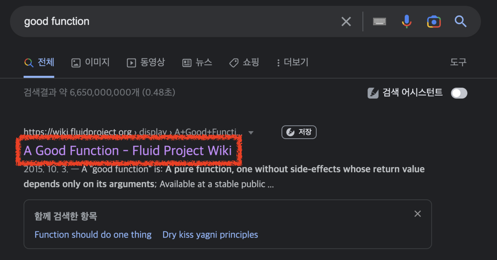
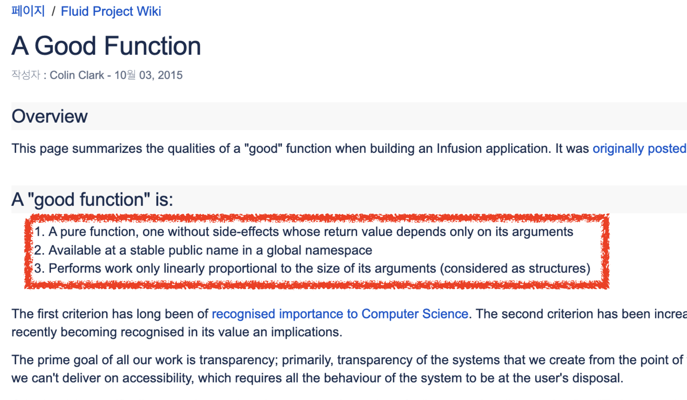
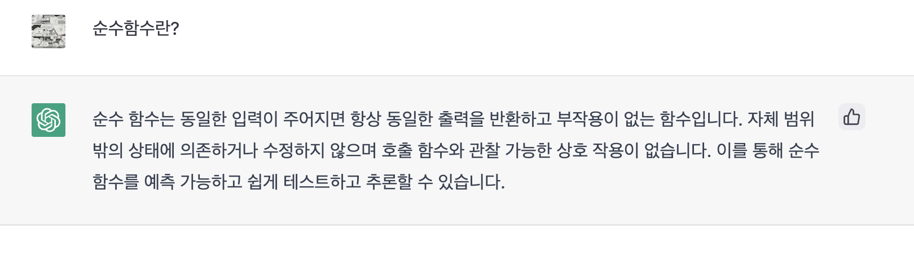

# 1. 좋은 함수 만들기 - 부작용과 거리두기

요즘의 개발에서 프레임워크나 라이브러리 사용이 없는 개발은 생각하기 어렵다.  
복잡한 애플리케이션 구현

다만, 이게 심해지다보면 실제 구현을 해야할 변수, 함수, 클래스 등을 잘 작성하는 것보다 **프레임워크나 라이브러리의 기능을 얼마나 많이 알고 있느냐**를 개발자의 성장으로 오해할 수도 있다.  
  
프레임워크와 라이브버리와 같은 도구에 대해서 숙련도가 높다면 당연히 좋겠지만, 그 이전에 좋은 변수, 함수, 클래스에 대해 먼저 고민하는 것도 필요하다.  
  
그래서 이번 시리즈에서는 좋은 함수에 대해서 이야기하려고 한다.

> JS/TS 환경에서 불변객체 다루는 방법이 순수 함수형 언어들에 비해 좋은 편은 아니라서, 이 글에서 함수형 프로그래밍에 대해 직접적인 언급을 하진 않을 예정이다.
> 어디까지나 좋은 "함수"에 대해서만 이야기한다.

## 좋은 함수

구글에서 좋은 함수 (Good Function)에 대해 검색해보면 다음과 같이 **순수 함수**에 대한 이야기가 자주 언급된다.



- https://wiki.fluidproject.org/display/fluid/A+Good+Function



순수함수란 무엇인지 요즘 유행하는 (?) [ChatGPT](https://chat.openai.com/chat) 에게 한번 물어보자.



- 동일한 입력이 주어지면 항상 동일한 출력을 반환하면서, 부작용 (Side Effect) 이 없는 함수
- 함수의 범위를 벗어난 상태 (전역변수 등)와 호출한 함수 등에 의존하지 않는 함수

정리하면, **동일한 입력일 경우 항상 동일한 출력을 반환하며, 부작용이 없는 함수**를 작성한다면 우린 좋은 함수를 작성한다고 할 수 있다.  
  
하지만 웹/앱 서비스등을 개발하다보면 이러한 부작용 (Side Effect) 에 영향을 줄 수밖에 없는데, 어떻게 좋은 함수를 만들 수 있을까?  
  
간단한 예제로 한번 시작해본다.

## 예제 

다음과 같이 **각 기업들의 판매 정보를 가져와 판매금액을 정산 해주는 기능**을 만든다고 가정해보자.   

```ts
export async function sendCompanyFees(companySellings: CompanySelling[]) {
  for (const companySelling of companySellings) {
    const fee = companySelling.sellingAmount * companySelling.commission;

    if (fee >= 100) {
      await axiosSendFee(companySelling.bankCode, fee);
    }
  }

  Modal.open(`${companySellings.length} 개 기업들에게 송금되었습니다.`);
}
```

> `for` 를 `Promise.all` 로 리팩토링 해야하는 것은 여기서 중요 개선점은 아니다.


이 함수의 요구 사항은 다음과 같다.

* 기업 판매 정보 (`CompanySelling`) 들을 받아서
* 각 기업별 정산 금액 (`판매금액 * 정산율`) 을 계산 해서  
* 100원이 넘는 경우에만
* API로 전달한다.

이 함수는 여러 기능을 한 곳에서 하고 있다.  
여러 책에서 이야기하듯, **함수는 하나의 기능만** 할 수 있도록 리팩토링을 해보자.

## 리팩토링 1 (Bad)

먼저 언급된 기능들 별로 하나씩 함수로 추출 (`Extract Function`) 한다. 

```ts
// 전체 기능을 관리한다
export async function sendCompanyFees(companySellings: CompanySelling[]) {
  await sendFees(companySellings);
  Modal.open(`${companySellings.length} 개 기업들에게 송금되었습니다.`);
}

// companySellings 만큼 sendFee를 호출한다
export async function sendFees(companySellings: CompanySelling[]) {
  for (const companySelling of companySellings) {
    await sendFee(companySelling);
  }
}

// 100원이상인 경우 axiosSendFee를 호출한다
export async function sendFee(companySelling: CompanySelling) {
  const fee = getFee(companySelling);

  if (fee >= 100) {
    // 100원 이상이면 송금하기
    await axiosSendFee(companySelling.bankCode, fee);
  }
}

function getFee(companySelling: CompanySelling) {
  return companySelling.sellingAmount * companySelling.commission;
}
```

기존에 1개였던 함수가 총 4개의 함수가 만들어졌다.  
각 함수는 아래와 같은 기능들을 한다.

- `sendCompanyFees`
  - `sendFees` 를 호출한다
  - `Modal` 로 결과를 출력한다
- `sendFees`
  - `companySellings` 전체를 순회하며 `sendFee` 를 호출한다
- `sendFee`
  - `getFee` 의 결과를 받아 `axiosSendFee` 에게 전달한다
- `getFee`
  - 정산금액을 계산한다

함수 하나가 1개의 기능을 담당하도록 잘 추출된 것처럼 보인다.  
이러면 좋은 함수를 만들어낸 것일까?  
  
위에서 언급했듯이 좋은 함수는 **테스트하기가 좋다**라고 했으니, 실제로 테스트하기도 좋아졌는지 한번 만들어보자.  
  
그리고 이 4개의 함수들 중 **순수 함수는 과연 몇개나 되는지** 한번 생각해보자.  
  
### 테스트 코드

먼저 가장 핵심 기능인 `sendFee` 의 테스트를 만들어본다.  
테스트를 작성하다보면 당연하게 **Mocking**이 필요함을 알게 된다.  

```ts
jest.mock('./api/axiosSendFee'); // API를 Mocking 한다

describe('sendFee', () => {
  it('100원이상이면 api를 호출한다', async () => {
    // when
    await sendFee({
      sellingAmount: 2000,
      commission: 0.1,
      bankCode: '032',
    });

    // then
    expect(axiosSendFee).toBeCalledTimes(1);
  });
});
```

그리고 테스트를 작성해보면 `sendFee` 의 테스트 코드 작성이 굉장히 어렵다는 것을 느낄 수 있다.

- 외부 API를 호출하는 `axiosSendFee` 를 Mocking 하지 없으면 `sendFee` 의 테스트가 실패한다
- `sendFee` 가 잘 수행되었는지를 확인 하는 것은 Mocking을 한 `axiosSendFee` 가 의도한대로 호출되었는지로만 검증해야한다.
  - 의도한 금액대로 나왔는지는 `getFee` 함수를 검증해야하지만, 이 함수는 `sendFee` 에서만 사용될 **private function**이다.
  - 외부에서 호출하는 것을 막기 위해 `private function` 으로 선언했는데 테스트를 위해 scope를 `public` 으로 변경하면 코드 디자인이 무너질 수 있다.

이렇게 작성된 테스트 코드는 크게 3가지 문제점이 있다.

#### (1) 상태 검증 불가능

이렇게 작성된 테스트 코드는 **다음과 같이 잘못 작성된 코드에서도 정상적으로 통과**되버린다.

```ts
export async function sendFee(companySelling: CompanySelling) {
  const fee = getFee(companySelling);

  if (fee >= 100) {
    await axiosSendFee(companySelling.bankCode, fee);
  }
}

function getFee(companySelling: CompanySelling) {
  // (*) 연산이 아닌 (+) 연산으로 잘못 작성된 코드
  return companySelling.sellingAmount + companySelling.commission;
}
```

위에서 작성된 코드는 axiosSendFee가 1번 호출되었냐만 검증하고 있는 **행위 검증**을 하는 테스트 코드이다.  
의도한대로 정산금이 만들어졌는지, 조건문에 맞는지 등 **상태 검증**을 하고 싶어도, 현재의 함수에서는 불가능하다.  

> 이 부분에 대한 자세한 소개는 마틴 파울러의 [mocks-arent-stubs](https://sungjk.github.io/2022/02/03/mocks-arent-stubs.html) 을 참고해보자.

#### (2) Mocking 대상 교체

이 테스트가 성립되기 위해서는 `axiosSendFee` 를 항상 Mokcing 해야만 한다.   
문제는 `sendFee` 가 호출해야하는 외부의 함수가 `axiosSendFee` 가 아니라 **react-query와 같이 아예 구현 방법이 다른** 라이브러리로 변경될 경우이다.  
이렇게 되면 기존에 작성된 `axiosSendFee` 를 Mocking 해서 검증하던 모든 테스트 코드들이 변경대상이 된다.  
라이브러리 하나 교체했다고 모든 테스트 코드들이 전부 수정대상이 되버린 것이다.  

#### (3) 테스트 도구 교체

(2)와 비슷한 이유로, 이번에는 **테스트 라이브러리가 교체**되는 이슈도 있다.  
예를 들어 요즘처럼 [Jest의 성능 이슈](https://github.com/facebook/jest/issues/11956)가 계속 발생할때면 Mocha 등 다른 테스트 프레임워크로 언제든 교체할 수 있다.  
이때 역시 마찬가지로 기존의 모든 Mocking을 하던 테스트 코드들은 수정 대상이 된다.  
  

문제는 이 `sendFee` 만 그런것이 아니다.  
다른 함수인 `sendFee`를 호출하는 `sendFees` 함수도 여전히 이 문제를 벗어날 수 없다.

```ts
jest.mock('./api/axiosSendFee'); // API를 Mocking 한다
describe('sendFees', () => {
  it('100원이상인 건수만큼 api를 호출한다', async () => {
    //given
    const sellings = [
      {
        sellingAmount: 1000,
        commission: 0.1,
        bankCode: '032',
      },
      {
        sellingAmount: 100,
        commission: 0.1,
        bankCode: '032',
      },
    ];

    // when
    await sendFees(sellings);

    // then
    expect(axiosSendFee).toBeCalledTimes(1);
  });
});
```

4개의 함수로 추출했지만, 그 어느 함수도 편하게 테스트를 작성할 수 있는 함수가 없다.  
어떻게 리팩토링을 했어야하는 것일까?

## 리팩토링 2 (Good)

현재의 테스트

```ts
export async function sendCompanyFees(companySellings: CompanySelling[]) {
  const companyFees = getCompanyFees(companySellings);
  for (const companyFee of companyFees) {
    await axiosSendFee(companyFee.bankCode, companyFee.fee);
  }
}
// ---------------------------------------------------------------------
// 순수함수
export function getCompanyFees(companySellings: CompanySelling[]) {
  return companySellings
    .map((c) => getCompanyFee(c))
    .filter((c) => c.fee >= 100); // 100원 이상이면 송금하기
}

function getCompanyFee(companySelling: CompanySelling) {
  return {
    fee: companySelling.sellingAmount * companySelling.commission,
    bankCode: companySelling.bankCode,
  };
}
```

누군가는 이 개선건에 대해 순회가 2번 이루어지기 때문에 비효율적인게 아니냐고 할 수 있다.  
하지만, **성능 개선은 실제 성능 이슈가 나오고 나서 하는게 좋다**.  
그전까지는 최대한 **테스트 하기 쉽고, 파악하기 좋은 코드**를 작성하는 것이 우선이다.  
이렇게 작성 되어야, 실제 성능 이슈가 발생해도 **어느 지점을 개선해야지 파악하기 쉽다**.

## 마무리

웹/앱 서비스를 개발하다보면 순수 함수로만 모든 것을 작성할 수는 없다.  
그래서 최대한 순수함수와 부작용 함수를 분리해서 부작용는 부작용 함수로 몰아넣어야 한다.


테스트하기가 쉽다고 꼭 좋은 함수일 수는 없지만,  
**좋은 함수는 테스트 하기가 쉽다**.  
그래서 현재의 함수가 테스트 하기가 어렵다면, 함수 설계에 대해 고민해볼 수 있는 신호가 된다.


