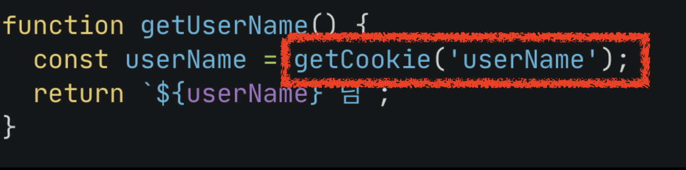
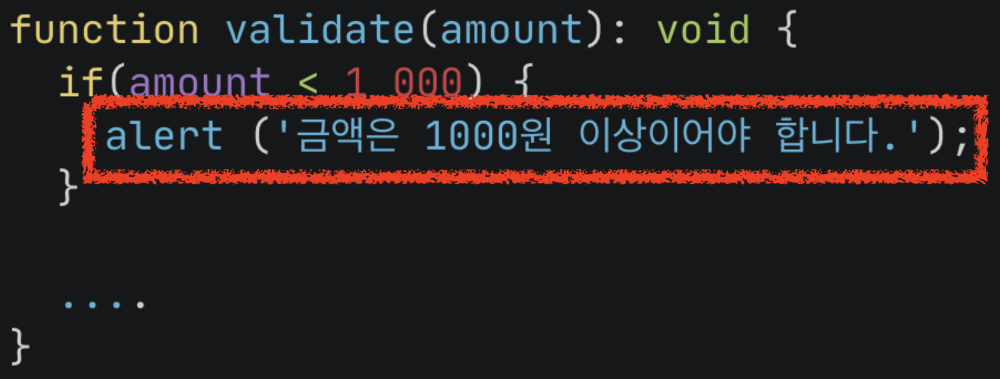
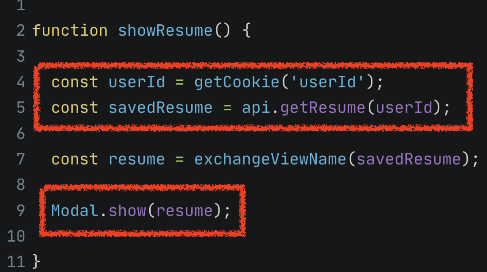
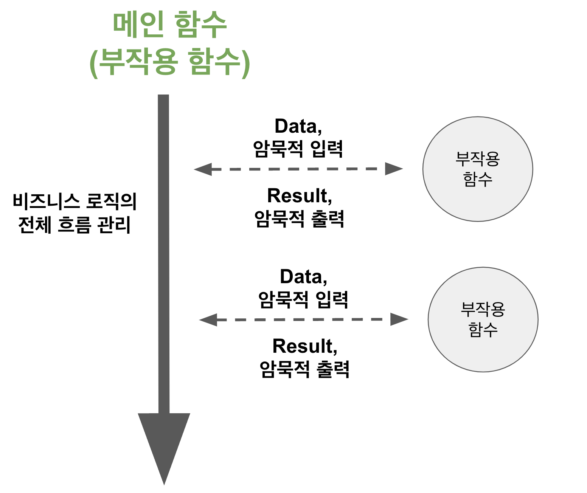
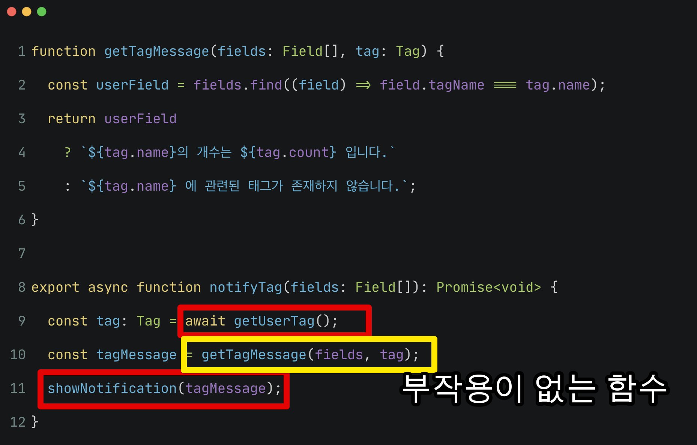

# 2. 좋은 함수 만들기 - 암묵적 입력/출력

[지난 시간](https://jojoldu.tistory.com/697) 에 부작용 (부수효과) 함수에서 어떻게 최대한 부작용과 거리두기를 해서 좋은 함수를 만드는지 간단한 예제로 연습해봤다.  
  
이번 시간에는 좋은 함수가 되기 위해 **관리해야할** 부작용이란 어떤 것들이 있는지 알아보자.

## 1. 암묵적 입력/출력

좋은 함수는 "부작용 (부수효과) 이 없으며, 멱등성을 유지할 수 있는 함수" 라고 했다.  
이 부작용 (부수효과) 함수에는 크게 2가지 특징이 있다.

- 암묵적 입력 (implicit input)
- 암묵적 출력 (implicit output)

### 1-1. 암묵적 입력 (implicit input)

암묵적 입력이란 **함수의 입력값으로 명시적으로 전달되지 않는 파라미터**를 의미한다.  
  
예를 들자면 다음과 같은 경우 암묵적 입력이다.



- 함수의 인자는 없는데
- 함수 내부에서 쿠키에서 값을 가져와서 (암묵적 입력)
- 특정 결과를 반환한다.

**함수의 인자로 아무것도 넣어주진 않았지만 반환값이 존재**한다.  
이는 어디선가 값을 가져온 것을 의미하는데, 이러면 우린 암묵적 입력을 사용한 함수를 만든 것이다.  
  
즉, 이 함수는 부작용 (부수효과) 함수이다.

그 외에도 웹 애플리케이션 구현시에는 대표적으로 다음과 같은 경우 암묵적 입력을 사용하는 것이다.

- 전역 변수에서 값을 가져올 경우
- 상태 관리에서 값을 가져올 경우
- 쿠키, LocalStorage, Dom 등에서 값을 가져온 경우
- API, 파일, DB 등 외부에서 값을 가져오는 경우 

### 1-2. 암묵적 출력 (implicit output)

암묵적 출력이란 **함수가 반환하는 값 이외에, 함수를 실행하는 동안에 외부에 영향을 주는 행위**들을 의미한다.  
  
예를 들자면 다음과 같은 경우 암묵적 출력이다.



- 함수의 인자가 있는데
- 함수 내부에서 브라우저에 `alert` 을 실행시키고 (암묵적 출력)
- 아무런 결과를 반환하지 않는다 (`void`)

**함수가 인자는 받았지만 아무것도 반환하지 않았다**.  
이는 어딘가에는 영향을 끼친 것을 의미하는데, 이러면 우린 암묵적 출력을 사용한 함수를 만든 것이다.  
  
즉, 이 함수는 부작용 (부수효과) 함수이다.

그 외에도 웹 애플리케이션 구현시에는 대표적으로 다음과 같은 경우 암묵적 출력을 사용하는 것이다.

- 전역 변수의 값을 변경하는 경우
- 쿠키, 세션등의 값을 변경하는 경우
- API, 파일 등 외부 서비스를 호출하는 경우
- Console.log 등 표준 입출력을 사용한 경우
- 브라우저 Windows 함수를 호출하는 경우

### 1-3. 암묵적 입력과 출력

정리하면 다음과 같은 경우 우린 부작용이 있는 함수라고 부를 수 있다.

- 인자값이 없는데 반환값이 있는 경우
- 인자값이 있는데 반환값이 없는 경우
- 인자값과 반환값 둘 다 없는 경우

인자값과 반환 둘 다 없는 경우는 다음과 같다.



암묵적 입력과 출력 모두가 존재하는 부작용 함수의 경우이다.  

암묵적 입력 혹은 출력을 가진 부작용 함수를 찾는 가장 쉬운 방법이 있다.  
암묵적 입력과 출력들의 경우를 보면 **대부분 비동기 함수**라는 것들을 알 수 있다.  
즉, `async` 가 필요한 경우 이 함수들은 예외없이 모두 **부작용 함수**이다.  
  
물론 **async가 없다고해서 모두가 부작용이 없는 함수인 것은 아니다**.  
전역 변수를 사용하거나 `console.log`를 사용하는 등이 존재하기 때문이다.  
**async가 있을 경우엔 부작용 함수**로 봐야한다는 것이다.  
  
정리 하면, 부작용이 있는 함수인지 판별하는 방법은 

- 인자값과 반환값 둘 중 하나라도 존재하지 않거나
- async 가 있거나

등의 경우엔 부작용 함수의 신호로 봐야 한다.

> 물론 가장 중요한 것은 코드를 보고 외부에 영향을 주는 것들이 있는지, 멱등성을 지키고 있는지를 봐야한다.

## 2. 실제 예제

예를 들어 다음과 같은 코드가 있다고 가정해보자.

```ts
export async function notifyTag(fields: Field[]): Promise<void> {
  const { name: userTagName, count } = await getUserTag();

  if (fields.find((field) => field.tagName === userTagName)) {
    showNotification(`${userTagName}의 개수는 ${count} 입니다.`);
  } else {
    showNotification(`${userTagName} 에 관련된 태그가 존재하지 않습니다.`);
  }
}
```

- 외부 API를 통해 User의 Tag 정보를 가져온다.
- 함수 인자로 전달 받은 Field 항목들을 비교해보면서
- 일치하는 경우와 그렇지 않을 경우에 따른 메세지를 노출시킨다.

이 함수를 리팩토링할때 `if ~ else` 전체를 함수로 추출해서 Notify에 대한 책임을 맡긴다면 이 리팩토링은 부작용 함수만 늘리게 된다.

```ts
function notifyUserTag(fields: Field[], userTagName: string, count: number) {
  if (fields.find((field) => field.tagName === userTagName)) {
    showNotification(`${userTagName}의 개수는 ${count} 입니다.`);
  } else {
    showNotification(`${userTagName} 에 관련된 태그가 존재하지 않습니다.`);
  }
}

export async function notifyTag(fields: Field[]): Promise<void> {
  const { name: userTagName, count } = await getUserTag();
  notifyUserTag(fields, userTagName, count);
}
```

- 리팩토링 결과인 함수 `notifyUserTag` 는 `showNotification` 로 인해 부작용 함수이다.
- 2개의 함수로 리팩토링 되었지만, 두개 함수 모두 부작용 함수이다.

부작용 함수를 리팩토링할때는 기능을 그대로 함수로 추출해서는 안된다.  
그럼 다음과 같이 또다른 부작용 함수가 생성된다.



### 2-1. 리팩토링

> 여기서 메인 함수는 `EventHandler`, `ViewComponent`, `ViewController` 등 부작용을 다루기 위한 Entry Point가 되는 함수들을 의미한다.

물론 새로운 함수 (설령 그게 부작용 함수라 하더라도)로 추출해서 가독성이나 단일 책임 원칙 등이 이루어지는 것 역시 리팩토링이다.  
다만, 우리의 목적은 **외부의 의존성이 없는 좋은 함수들을 많이 만들고, 외부에 영향을 받는/주는 부작용 함수의 범위를 최소화** 하는 것이다.  
이를 위해서는 가능한 아래와 같이 리팩토링을 한다.

- **부작용을 제외한** 순수 로직들만 추출해본다.
- 추출된 순수 로직이 해야할 역할을 다시 정의하고, **책임에 맞는 추상화**를 한다.
- 순수 로직의 결과와 부작용 함수를 연결하는 것은 메인 함수 (부작용 함수)에서 다룬다


위 코드에서 순수 로직은 다음의 2가지이다.

- `if` 의 조건절 
  - `fields.find((field) => field.tagName === userTagName)`
- `showNotification` 에서 사용하는 서로 다른 메세지

이 들을 추출만 먼저 해보자.

```ts
export async function notifyTag(fields: Field[]): Promise<void> {
  const { name: userTagName, count } = await getUserTag();

  if (hasTagName(fields, userTagName)) {
    showNotification(getTagCountMessage(userTagName, count));
  } else {
    showNotification(getEmptyMessage(userTagName));
  }
}

function hasTagName(fields: Field[], userTagName: string) {
  return fields.find((field) => field.tagName === userTagName);
}

function getTagCountMessage(userTagName: string, count: number) {
  return `${userTagName}의 개수는 ${count} 입니다.`;
}

function getEmptyMessage(userTagName: string) {
  return `${userTagName} 에 관련된 태그가 존재하지 않습니다.`;
}
```

- `hasTagName`
  - `if` 절의 코드를 함수로 추출
- `getTagCountMessage`, `getEmptyMessage`
  - 각각의 조건에 따른 메세지를 함수로 추출

이렇게 리팩토링으로 만들어진 함수들은 모두 **명시적인 입력값과 반환 결과를 모두 가지고 있다**.  
여기까지만 해도 순수 함수로의 리팩토링이 끝난것 같다.  
하지만 위에서도 언급했던 2번째 해야할 리팩토링인 **책임에 맞는 추상화**가 진행되지 않았다.  
  
위에서 추출했던 2개의 순수 로직 (TagName 유무, 메세지 생성)이 결국 하고자했던 책임은 무엇이였을까?  
  
그건 바로 **Notification 에서 사용할 Tag 메세지를 만드는 것**이다.  
2개의 로직 모두 이를 위해 존재한다.  
그렇다면 추출된 순수 로직들을 다시 한번 리팩토링 하여 **Tag 메세지를 만드는 함수**로 변환해보자.  
  
```ts
export async function notifyTag(fields: Field[]): Promise<void> {
  const tag: Tag = await getUserTag();
  const tagMessage = getTagMessage(fields, tag);
  showNotification(tagMessage);
}

function getTagMessage(fields: Field[], tag: Tag) {
  const userField = fields.find((field) => field.tagName === tag.name);
  return userField
    ? `${tag.name}의 개수는 ${tag.count} 입니다.`
    : `${tag.name} 에 관련된 태그가 존재하지 않습니다.`;
}
```

- 리팩토링으로 만들어진 `getTagMessage` 는 이제 `TagMessage`를 만드는 책임을 가진 추상화된 함수가 되었다.
- 메인 함수인 `notifyTag` 는 TagMessage를 또다른 부작용 함수인 `showNotification` 에 데이터로 전달만 하면 된다.
  - 그 전처럼 `showNotification` 에 어떤 함수 결과를 전달해야하는지에 대한 로직을 책임지지 않아도 된다.

최종적으로 1) Tag 메세지에 대한 책임을 가지고 있는 2) 부작용이 없는 순수 함수 `getTagMessage` 가 완성되었다.  


  
그에 따라 기존의 `notifyTag` 코드 역시 비즈니스 로직의 전체 흐름에 대한 관리만 할 수 있게 되었다.
## 마무리

함수를 만들었지만, 그 함수에서 입력값이 없거나 반환이 없다면 이는 부작용 함수일 확률이 높다.  
그럴때는 
- 명시적인 입력값과 반환값이 있는 함수로 리팩토링을 하고 
- 리팩토링된 함수들의 책임과 역할을 적절하게 추상화를 해본다. 

이렇게 한다면 본인의 프로젝트가 조금 더 명확한 역할과 책임을 가진 순수  함수들이 점점 늘어날 것이다.  
그리고 단위 테스트의 작성이 쉽고, 커버할 수 있는 비즈니스 로직이 넓어져 전보다 견고한 프로젝트가 될 수 있다.
