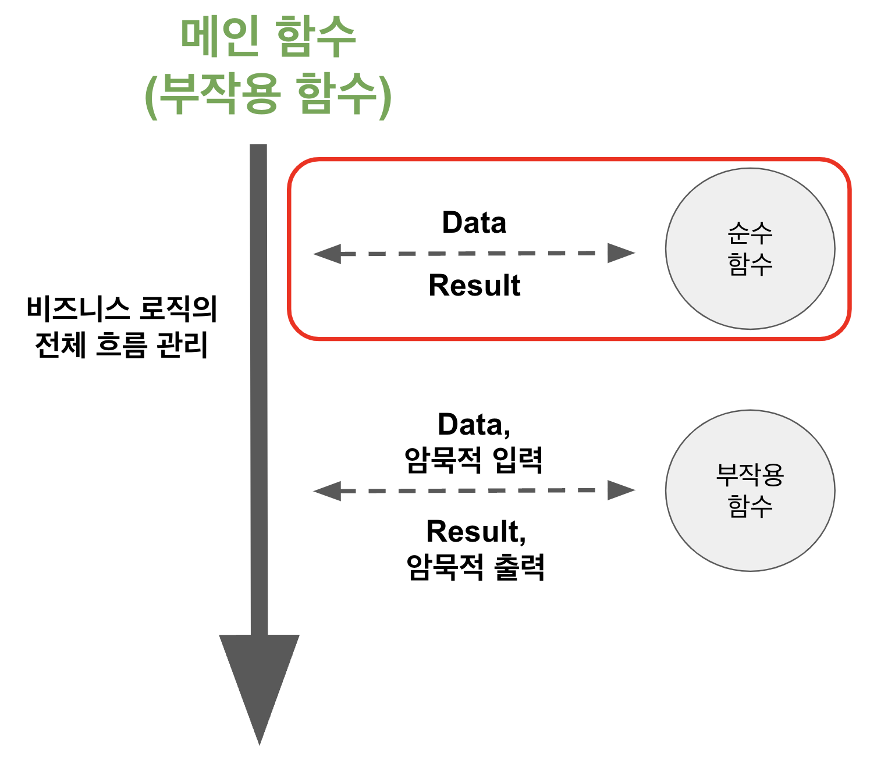

# 2. 좋은 함수 만들기 - 부작용 (부수효과) 관리하기

[지난 시간](https://jojoldu.tistory.com/697) 에 부작용 (부수효과) 함수에서 어떻게 최대한 부작용과 거리두기를 해서 좋은 함수를 만드는 연습을 했다.    
  
이번 시간에는 좋은 함수가 거리를 두어야할 부작용이란 어떤 것들이 있는지 알아보자.

## 1. 암묵적 입력/출력

좋은 함수는 "부작용 (부수효과) 이 없으며, 멱등성을 유지할 수 있는 함수" 라고 했다.  
이 부작용 (부수효과) 함수에는 크게 2가지 특징이 있다.

- 암묵적 입력 (implicit input)
- 암묵적 출력 (implicit output)

### 1-1. 암묵적 입력 (implicit input)

암묵적 입력이란 **함수의 입력값으로 명시적으로 전달되지 않는 파라미터**를 의미한다.  
  
예를 들자면 다음과 같은 경우 암묵적 입력이다.


- 함수의 인자는 없는데
- 함수 내부에서 쿠키에서 값을 가져와서 (암묵적 입력)
- 특정 결과를 반환한다.

**함수의 인자로 아무것도 넣어주진 않았지만 반환값이 존재**한다.  
이는 어디선가 값을 가져온 것을 의미하는데, 이러면 우린 암묵적 입력을 사용한 함수를 만든 것이다.  
  
즉, 이 함수는 부작용 (부수효과) 함수이다.

그 외에도 다음과 같은 경우 암묵적 입력을 사용하는 것이다.

- 전역 변수에서 값을 가져올 경우
- 상태 관리에서 값을 가져올 경우
- 쿠키, LocalStorage, Dom 등에서 값을 가져온 경우
- API, 파일, DB 등 외부에서 값을 가져오는 경우 

### 1-2. 암묵적 출력 (implicit output)

암묵적 출력이란 **함수가 반환하는 값 이외에, 함수를 실행하는 동안에 외부에 영향을 주는 행위**들을 의미한다.  
  
예를 들자면 다음과 같은 경우 암묵적 출력이다.


- 함수의 인자가 있는데
- 함수 내부에서 브라우저에 `alert` 을 실행시키고 (암묵적 출력)
- 아무런 결과를 반환하지 않는다 (`void`)

**함수가 인자는 받았지만 아무것도 반환하지 않았다**.  
이는 어딘가에는 영향을 끼친 것을 의미하는데, 이러면 우린 암묵적 출력을 사용한 함수를 만든 것이다.  
  
즉, 이 함수는 부작용 (부수효과) 함수이다.

그 외에도 다음과 같은 경우 암묵적 출력을 사용하는 것이다.

- 전역 변수의 값을 변경하는 경우
- 쿠키, 세션등의 값을 변경하는 경우
- API, 파일 등 외부 서비스를 호출하는 경우
- Console.log 등 표준 입출력을 사용한 경우
- 브라우저 Windows 함수를 호출하는 경우


###3 부작용 함수

- 인자값이 없는데 반환값이 있는 경우
- 인자값이 있는데 반환값이 없는 경우
- 인자값과 반환값 둘 다 없는 경우
- async 가 선언된 경우


부수 효과가 없다는 것
- 인자값과 반환값 둘 다 있으면서
- async 가 없는 경우

단위 테스트에 적합한 함수     


## 실제 예제

```ts

if (fields.find(({ tagName: tempTagName }) => tempTagName === parsedTagName)){
    showNotification();

    return;
}
```

외부에 영향을 주는 부작용까지는 함수 추출의 대상이 아니다.
부작용을 제외한 나머지 부분만 함수 추출의 대상이 된다.
EventHandler, ViewComponent 등 부작용을 다루기 위한 계층에서 부작용 함수와 순수 함수를 연결시킨다.


